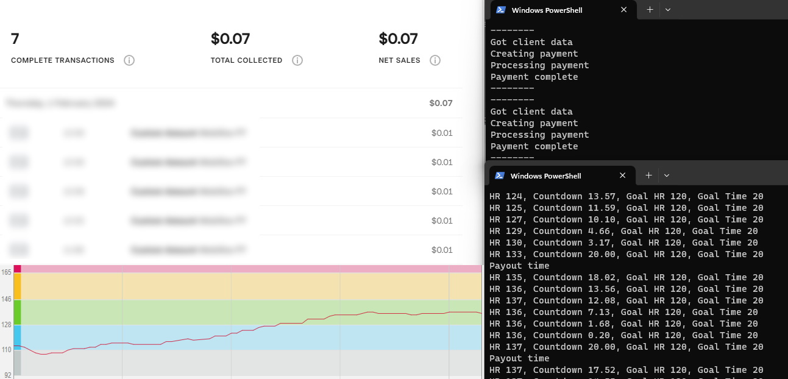

# Working HR Zone payments #

Gamifying and financially incentivising clients to stay in HR zones Using a Polar HR monitor and square payments API

### Hardware Used ###
* Polar H10
* Windows PC with Bluetooth

### Method ###

* Create a client via square.
* Update ```payments.py``` with the client email and auth token.
* Wear the Polar HR monitor.
* Load python venv for the payment system ```python -m venv payments``` and activate the env.
* ```pip install -r requirements.txt```
* ```python .\payments.py```

* Load python venv for the tracker ```python -m venv tracker``` and activate the env.
* ```pip install -r requirements.txt```
* ```python .\tracker.py```

### Result ###

